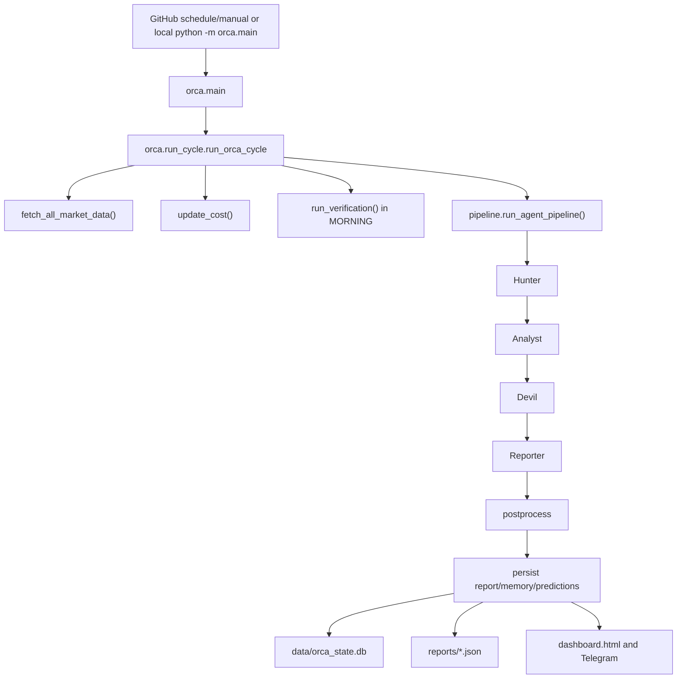
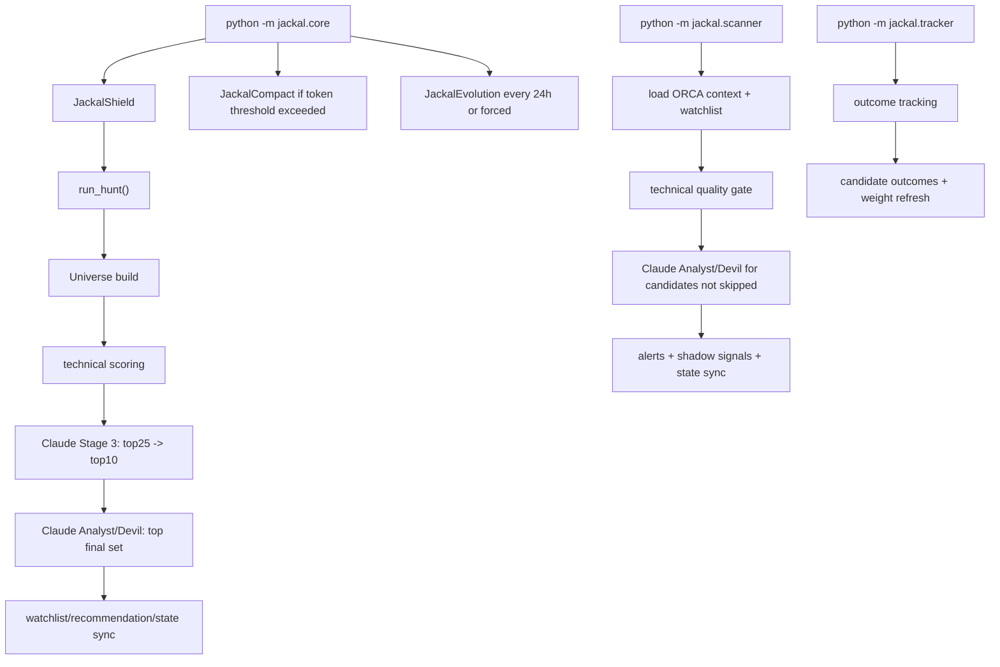

> 📦 Archived: 이 문서의 path는 Phase 0.2 이전 구조 기준입니다.
> 현재 위치는 apps/orca/, apps/jackal/입니다.

# O.R.C.A Repository and Claude API Usage Audit

작성일: 2026-05-06  
대상 경로: `C:\Users\skyco\OneDrive\문서\GitHub\O.R.C.A`  
범위: 리포지터리 구조, ORCA/JACKAL 실행 흐름, Anthropic/Claude API 호출부, GitHub Actions secret 주입 경로, 비용 추정 및 운영 상태

## 1. Executive Summary

이 리포지터리는 `ORCA + JACKAL`이라는 두 축으로 구성된 금융 시장 분석 및 후보 종목 발굴 시스템이다.

- `ORCA`는 시장 데이터, 웹 검색, 과거 메모리, 예측 검증을 결합해 일간/저녁/주간/월간 시장 리포트를 생성한다.
- `JACKAL`은 ORCA의 시장 레짐과 자체 기술적 신호를 사용해 신규 후보 종목을 발굴하고, 스캐너/트래커/진화 루프를 통해 후보 품질을 학습한다.
- 운영 상태 저장은 `data/orca_state.db`와 `data/jackal_state.db`가 중심이며, JSON 파일은 메모리, 비용 추정, 리포트, 가중치, 포트폴리오 등을 보조한다.
- Claude API는 제거된 상태가 아니다. ORCA와 JACKAL의 핵심 분석/선별/웹 검색/진화 경로에서 `anthropic` SDK를 직접 사용한다.
- 로컬 환경에는 `.env`가 없고 현재 셸에도 `ANTHROPIC_API_KEY`가 보이지 않았지만, GitHub Actions는 여러 워크플로에서 `secrets.ANTHROPIC_API_KEY`를 주입한다.
- 따라서 "로컬 Codex에서 파일을 보고 명령을 실행하는 것"은 Claude 비용이 아니지만, GitHub Actions의 ORCA/JACKAL 운영 실행은 Claude 비용이 발생할 수 있다.
- 현재 repo의 비용 파일 `data/orca_cost.json`은 실제 과금 로그가 아니라 `orca/data.py`의 고정 단가 추정치다. JACKAL 쪽 토큰 사용량 로깅은 헬퍼가 있으나 실제 Anthropic 호출부와 연결되어 있지 않아 비용 가시성이 불완전하다.

## 2. Repository Identity

README 기준 이름:

- `ORCA`: `Omnidirectional Risk & Context Analyzer`
- `JACKAL`: `Just-in-time Alert for Candidates & Key Asset Leverage`

주요 디렉터리:

| 경로 | 역할 |
|---|---|
| `.github/workflows/` | 예약 실행, 백테스트, 품질 검사, 대시보드 배포, 정책 평가 |
| `orca/` | 시장 데이터 수집, Claude agent pipeline, 리포트 생성, 검증, 상태 DB, 대시보드 |
| `jackal/` | 후보 발굴, 스캐너, 트래커, 자체 학습, 품질/확률 보정 |
| `data/` | 운영 상태 JSON/SQLite, 메모리, 정확도, 비용, 포트폴리오 |
| `reports/` | 생성된 시장 리포트 JSON, 대시보드 HTML, 연구/정책 산출물 |
| `docs/` | 아키텍처, phase별 runbook, 후보 registry 설계, 릴리즈 준비 문서 |
| `tests/` | 단위/계약/퇴행 테스트 |
| `scripts/` | 품질 감사, 백필, lesson cluster 빌드, 주간/월간 리포트 보조 |

코드 규모:

- `orca/`: Python 파일 43개, 약 20,746라인
- `jackal/`: Python 파일 19개, 약 9,766라인
- `tests/`: Python 테스트 파일 45개, `def test_` 기준 561개
- 기존 `tests_result.txt`: `Ran 499 tests ... OK (skipped=3)` 기록 확인

## 3. High-Level Architecture

### 3.1 ORCA

ORCA는 시장 전체를 판단하는 상위 분석기다. 기본 실행 진입점은 `python -m orca` 또는 `python -m orca.main`이다.

주요 흐름:



핵심 모듈:

- `orca/main.py`: CLI 진입점과 mode resolution.
- `orca/run_cycle.py`: 전체 실행 오케스트레이션, health tracker, data quality handling, report persistence.
- `orca/data.py`: Yahoo/FearGreed/KRX/FRED/FSC/뉴스 데이터 수집, `data_quality`, 비용 추정.
- `orca/pipeline.py`: Hunter -> Analyst -> Devil -> Reporter 조합.
- `orca/agents.py`: Claude agent 4단계의 실제 LLM 호출부.
- `orca/analysis.py`: verification/lesson/market/review facade.
- `orca/state.py`: SQLite state spine. runs, predictions, outcomes, candidate registry, lessons, archive, retrieval log 등 다수 테이블 관리.
- `orca/postprocess.py`: 한국 claims 정리, candidate review, probability summary, dashboard/news 보조 처리.
- `orca/persist.py`, `orca/present.py`: 파일 저장과 콘솔/Telegram/HTML presentation.

### 3.2 JACKAL

JACKAL은 ORCA의 시장 레짐을 읽어 구체적인 후보 종목을 찾고 타이밍을 평가하는 하위 기회 엔진이다.

주요 흐름:



핵심 모듈:

- `jackal/core.py`: Shield -> Hunter -> Compact -> Evolution 세션 진입점.
- `jackal/hunter.py`: 신규 후보 universe 구성, 기술 점수, Claude 선별, watchlist 작성.
- `jackal/scanner.py`: 포트폴리오/후보/watchlist 스캔, 품질 gate, Claude analyst/devil, 알림.
- `jackal/tracker.py`: 후보 성과 추적. 워크플로 주석상 LLM 호출 없음.
- `jackal/evolution.py`: 최근 성과를 바탕으로 skill/instinct/weight adjustment를 Claude로 생성.
- `jackal/compact.py`: 토큰 사용량이 threshold를 넘을 때 context summary 생성.
- `jackal/shield.py`: secret scan, budget/spike check. 단, 실제 호출부의 usage logging 연결은 미완성.
- `jackal/adapter.py`: ORCA baseline/memory/fallback 레짐을 JACKAL로 연결.
- `jackal/quality_engine.py`, `thresholds.py`, `probability.py`: 사전 품질 gate와 확률 보정.

## 4. Current Runtime State

### 4.1 Data and Report Artifacts

현재 `data/` 주요 상태:

- `data/orca_state.db`: 약 21.4MB
- `data/jackal_state.db`: 약 0.23MB
- `data/memory.json`: 약 275KB
- `data/orca_cost.json`: 비용 추정 누적 파일
- `data/accuracy.json`: 예측 검증 누적 파일
- `data/orca_weights.json`, `data/rotation.json`, `data/sentiment.json`: 시장 판단 보조 state
- `data/portfolio.json`: 보유/관심 포트폴리오 정의

SQLite 테이블 카운트 확인:

| DB | 주요 테이블 | 현재 row 수 |
|---|---:|---:|
| `data/orca_state.db` | `runs` | 39 |
| `data/orca_state.db` | `predictions` | 65 |
| `data/orca_state.db` | `outcomes` | 20 |
| `data/orca_state.db` | `candidate_registry` | 3,929 |
| `data/orca_state.db` | `candidate_outcomes` | 7,868 |
| `data/orca_state.db` | `candidate_lessons` | 3,919 |
| `data/orca_state.db` | `lesson_archive` | 3,874 |
| `data/orca_state.db` | `lesson_clusters` | 33 |
| `data/jackal_state.db` | `jackal_live_events` | 10 |
| `data/jackal_state.db` | `jackal_accuracy_projection` | 89 |
| `data/jackal_state.db` | `jackal_weight_snapshots` | 1 |

최근 ORCA run 상태:

- 최신 `2026-05-06 MORNING` run은 `completed`, `data_quality=degraded`.
- degraded 이유는 `external_data_degraded`.
- 최신 리포트의 실패 소스는 `KRX_API` unavailable, `KOREA_NEWS` no_headlines.
- 즉, 최신 degraded는 Claude API 문제가 아니라 외부 시장/뉴스 데이터 소스 품질 문제다.

### 4.2 Cost State

`data/orca_cost.json` 현재 값:

```json
{
  "total_runs": 74,
  "monthly_runs": {
    "2026-04": {"runs": 68, "estimated_usd": 75.3},
    "2026-05": {"runs": 6, "estimated_usd": 5.8}
  },
  "estimated_cost_usd": 81.1,
  "last_run": "2026-05-06 09:11 KST"
}
```

주의:

- 이 파일은 Anthropic 실제 invoice가 아니다.
- `orca/data.py`의 `update_cost()`가 mode별 고정값을 더한다.
- 현재 고정값은 `MORNING=1.2`, `AFTERNOON=0.5`, `EVENING=0.5`, `DAWN=0.7`, 기타 `0.8` USD다.
- 실제 비용은 model, input/output token, web search usage, retry, workflow 실행 횟수에 따라 달라진다.
- JACKAL 호출 비용은 이 ORCA cost 파일에 자동 반영되지 않는다.

## 5. Claude / Anthropic API Usage Audit

### 5.1 Dependency and Environment

필수 dependency:

- `requirements.txt`: `anthropic>=0.94.0,<1.0`

환경 변수:

- `.env.example`은 `ANTHROPIC_API_KEY`를 필수로 선언한다.
- ORCA model override:
  - `ORCA_MODEL=claude-sonnet-4-6`
  - `ORCA_MODEL_HUNTER=claude-haiku-4-5-20251001`
  - `ORCA_MODEL_LITE=claude-sonnet-4-6`
- JACKAL model override:
  - `SUBAGENT_MODEL=claude-haiku-4-5-20251001`

현재 로컬 조사 결과:

- repo root에 `.env` 없음.
- 현재 PowerShell 환경에서 `ANTHROPIC_API_KEY`, `ORCA_MODEL`, `ANTHROPIC_MODEL`, `SUBAGENT_MODEL`은 출력되지 않음.
- 따라서 지금 로컬 셸에서 ORCA/JACKAL LLM 경로를 직접 실행하면, GitHub secret과 별개로 Anthropic 인증 실패가 날 가능성이 높다.

중요 구분:

- Codex가 이 리포지터리를 읽고 문서를 작성하는 현재 작업은 이 repo의 `ANTHROPIC_API_KEY`를 사용하지 않는다.
- GitHub Actions에서 `python -m orca.main`, `python -m jackal.core`, `python -m jackal.scanner`, `python -m orca.backtest` 등을 실행하면 workflow env의 `secrets.ANTHROPIC_API_KEY`를 사용한다.

### 5.2 ORCA Active Claude Call Sites

| 파일 | 라인 | 호출 방식 | 실행되는 경우 | 모델/비고 |
|---|---:|---|---|---|
| `orca/agents.py` | 17, 21, 41 | `import anthropic`, `Anthropic(api_key=API_KEY)` | ORCA agent pipeline import 시 client 생성 | 모든 ORCA agent 공통 |
| `orca/agents.py` | 105-123 | `call_api()` -> `client.messages.stream()` | Hunter/Analyst/Devil/Reporter가 호출 | retry 포함, 일부 web search |
| `orca/agents.py` | 255-262 | `agent_hunter()` -> `call_api(use_search=True)` | ORCA daily pipeline Hunter | `ORCA_MODEL_HUNTER`, web search |
| `orca/agents.py` | 360-364 | `agent_analyst()` -> `call_api()` | Hunter 이후 분석 | `ORCA_MODEL` |
| `orca/agents.py` | 426-430 | `agent_devil()` -> `call_api()` | Analyst 반론 생성 | `ORCA_MODEL` |
| `orca/agents.py` | 566-570 | `agent_reporter()` -> `call_api()` | 최종 리포트 생성 | Morning full/lite 구분 |
| `orca/analysis.py` | 18, 76-78 | Anthropic client 생성 | verification wrapper import | `ORCA_MODEL`/`ANTHROPIC_MODEL` |
| `orca/analysis_verification.py` | 158-164 | `client.messages.stream(... tools=web_search...)` | 기존 prediction 중 deterministic 검증이 불명확한 항목 | web search 사용 |
| `orca/analysis_lessons.py` | 184 | `client.messages.stream()` | DAWN lesson 추출/자기반성 경로 | web search 없음 |
| `orca/backtest.py` | 19, 1173-1174, 1277 | Anthropic client + stream | ORCA backtest 분석 생성 | README도 backtest key 필요 명시 |
| `orca/notify.py` | 9, 29-31, 567 | breaking news detector | 속보 체크 실행 시 | Haiku, web search |
| `orca/notify.py` | 626 | calendar report | 경제 캘린더 리포트 실행 시 | Haiku, web search |
| `orca/postprocess.py` | 198, 239-255 | `agents.call_api(... use_search=True)` | Morning 후 JACKAL watchlist 뉴스 보강, Hunter 결과 부족 시 | Haiku 1회 예상이라고 주석 |

판정:

- ORCA의 일반 일간 리포트는 Claude API 없이는 정상 완료되기 어렵다.
- 단, `--history`, 일부 데이터 수집/대시보드/상태 조회성 코드, unit test의 mock 경로는 Claude 없이도 동작할 수 있다.
- 최신 리포트가 생성된 것은 GitHub Actions secret이 주입되었기 때문으로 보는 것이 가장 타당하다.

### 5.3 JACKAL Active Claude Call Sites

| 파일 | 라인 | 호출 방식 | 실행되는 경우 | 모델/비고 |
|---|---:|---|---|---|
| `jackal/hunter.py` | 28, 65 | `from anthropic import Anthropic`, `MODEL_H=SUBAGENT_MODEL` | Hunter import | 기본 Haiku |
| `jackal/hunter.py` | 283-317 | `_claude_suggest_20()` | ARIA 뉴스 기반 universe 확장 | web search 사용 |
| `jackal/hunter.py` | 911-950 | `_stage3_quick_scan()` | top25 -> top10 선별 | web search 없음, 실패 시 top25[:10] fallback |
| `jackal/hunter.py` | 1098, 1185 | `_analyst_swing()` | top 후보별 bullish 분석 | 실패 시 score 50 fallback |
| `jackal/hunter.py` | 1212, 1290 | `_devil_swing()` | top 후보별 반론/리스크 분석 | 실패/parse 실패 metadata 기록 |
| `jackal/scanner.py` | 26, 83 | Anthropic import/model 설정 | Scanner import | 기본 Haiku |
| `jackal/scanner.py` | 553-647 | `agent_analyst()` | quality gate 통과 종목 | 실패 시 score 50 fallback |
| `jackal/scanner.py` | 659-740 | `agent_devil()` | Analyst 이후 반론 평가 | 실패/parse 실패 fallback |
| `jackal/scanner.py` | 1411-1470 | `_suggest_extra_tickers()` | ARIA 기반 watchlist 추가 추천 | 실패 시 `{}` |
| `jackal/compact.py` | 19, 39, 189 | `JackalCompact` -> `_summarize()` | token threshold 초과 또는 force compact | usage summary 생성 |
| `jackal/evolution.py` | 21, 173, 684 | `JackalEvolution` -> `_ask_claude()` | 24시간 경과 또는 force evolve | skills/instincts/weight adjustments 생성 |

판정:

- JACKAL Hunter/Scanner는 LLM 호출 실패 시 일부 fallback이 있어 "완전히 즉시 죽지는 않는" 경로가 많다.
- 하지만 후보 추천 품질과 Analyst/Devil 판단은 Claude 호출에 강하게 의존한다.
- `jackal/tracker.py`는 워크플로 주석 기준 LLM 호출 없음. 시장 데이터 기반 후행 tracking이다.

### 5.4 Misleading or Non-Active Claude Mentions

| 위치 | 내용 | 판정 |
|---|---|---|
| `tests/fixtures.py`, 여러 `tests/test_*` | `anthropic` mock/stub 생성 | 테스트 격리용, 실제 비용 없음 |
| `jackal/shield.py` | `log_usage()` docstring 예시 안의 `client.messages.create` | 실제 호출 아님 |
| `README.md` | backtest requires `ANTHROPIC_API_KEY` | 문서 언급 |
| `data/memory.json`, `reports/*.json` | OpenAI/Claude/AI 관련 뉴스 텍스트 | 시장 뉴스 데이터, API 호출 아님 |

### 5.5 GitHub Actions Secret Injection

Anthropic secret이 들어가는 주요 workflow:

| Workflow | 라인 | 실행 내용 | Claude 비용 가능성 |
|---|---:|---|---|
| `.github/workflows/orca_daily.yml` | 138, 142-145 | `python -m orca.main`, ORCA daily/evening/weekly/monthly dispatcher | 높음 |
| `.github/workflows/jackal_session.yml` | 142-168 | JACKAL Hunter + Scanner 세션 | 높음 |
| `.github/workflows/jackal_session.yml` | 80-83 | manual/ad-hoc scanner | 중간~높음 |
| `.github/workflows/orca_backtest.yml` | 155, 170 | ORCA/JACKAL backtest live mode | 높음, 실행량에 따라 큼 |
| `.github/workflows/jackal_backtest_learning.yml` | 284, 298 | ORCA refresh + JACKAL backtest learning | 높음 |

반대로 다음 workflow는 기본적으로 Claude 호출이 없거나 목적이 다르다.

- `jackal_tracker.yml`: 주석상 "Cost profile: no LLM calls; yfinance/market data only."
- `quality.yml`: compileall, JSON parse, SQLite integrity, drift/audit smoke 중심. `ANTHROPIC_API_KEY` 주입 없음.

## 6. Why It Appears To Work Without A Local Claude Key

가능한 원인은 네 가지로 나뉜다.

1. 지금 Codex 작업은 repo 내부 코드가 아니라 Codex 환경의 파일 읽기/명령 실행이다. 이 과정은 repo의 Claude API key를 사용하지 않는다.
2. GitHub Actions 운영 실행은 로컬 `.env`가 아니라 GitHub repository secret에서 `ANTHROPIC_API_KEY`를 주입한다.
3. JACKAL 일부 함수는 Claude 호출 실패 시 fallback score 또는 빈 결과를 반환하므로, 품질은 떨어져도 프로세스가 끝까지 가는 경로가 있다.
4. `data_quality=degraded`는 외부 데이터 소스 실패를 의미한다. 최신 리포트의 degraded 원인은 `KRX_API`, `KOREA_NEWS`였고 Anthropic 인증 실패가 아니다.

따라서 "Claude API 없이 완전히 운영 중"이라는 해석은 맞지 않다. 더 정확한 결론은:

- 로컬 Codex 분석/문서화 작업은 Claude API 비용이 아니다.
- 운영 리포트와 JACKAL 세션은 GitHub Secrets의 Anthropic key를 통해 Claude API를 계속 사용할 수 있다.
- 일부 보조/검증/트래킹/테스트 경로는 Claude 없이도 실행된다.

## 7. Cost Control Assessment

### 7.1 Current Cost Controls

현재 비용 관련 장치:

- ORCA token budget: `orca/agents.py`의 `_TOK`가 Hunter/Analyst/Devil/Reporter max_tokens를 제한한다.
- ORCA 고정 추정 비용: `orca/data.py:update_cost()`.
- JACKAL budget shield: `jackal/shield.py`가 `JACKAL_DAILY_BUDGET`과 spike ratio를 검사한다.
- JACKAL compaction: `jackal/compact.py`가 threshold 초과 시 context를 요약하도록 설계.
- GitHub workflow concurrency: 대부분 `orca-repo-state` group으로 동시 state write를 줄인다.

### 7.2 Cost Visibility Gaps

중요한 빈틈:

1. ORCA 비용은 실제 token usage가 아니라 고정 단가다.
2. `orca/agents.call_api()`는 response usage를 저장하지 않는다.
3. JACKAL `log_usage()` 헬퍼는 있지만 실제 `hunter.py`, `scanner.py`, `evolution.py`, `compact.py` 호출부에서 호출되지 않는다.
4. `jackal/jackal_usage_log.json`은 현재 존재하지 않는다.
5. Web search tool 사용량은 별도 비용/토큰 영향을 줄 수 있지만 repo 내부 추정치에 정확히 반영되지 않는다.
6. retry 발생 시 비용 추정과 실제 비용 간 괴리가 커질 수 있다.

실무적 결론:

- `data/orca_cost.json`은 "운영자가 보는 rough estimate"로는 유용하다.
- 실제 Anthropic 비용 관리는 provider console 기준으로 확인해야 한다.
- repo 내부 비용 계측을 믿고 budget을 제어하기에는 아직 미완성이다.

## 8. Reliability and Operational Risks

### 8.1 External Data Degradation

최신 리포트는 `data_quality=degraded`였고 실패 소스는 `KRX_API`, `KOREA_NEWS`였다.

ORCA는 `poor`면 분석을 중단하고 minimal failed report를 저장하지만, `degraded`면 health warning을 기록하고 분석을 계속한다. 이 설계는 운영 지속성에는 좋지만, 리포트 신뢰도 해석에는 주의가 필요하다.

### 8.2 LLM Dependency

ORCA 리포트의 핵심 판단은 Claude agent pipeline에 의존한다.

- Hunter는 web search 포함.
- Analyst/Devil/Reporter는 JSON-only contract에 의존.
- JSON parsing fallback은 많지만, 모델 응답 quality drift가 생기면 리포트 품질이 흔들릴 수 있다.

JACKAL은 quality gate와 fallback이 상대적으로 많지만, 후보 선별의 핵심 단계에서 여전히 Claude 판단이 들어간다.

### 8.3 Statefulness

리포지터리는 tracked JSON과 SQLite DB를 운영 state로 포함한다.

장점:

- GitHub Actions만으로도 상태가 이어진다.
- DB 기반 candidate registry와 lesson archive가 축적된다.

위험:

- Git 기반 mutable state 충돌 가능성.
- 대형 DB 변경이 PR/repo noise를 만든다.
- workflow concurrency가 있어도 장기적으로 state artifact 전략이 더 안전하다.

### 8.4 Encoding / Output Noise

PowerShell `Get-Content` 출력에서 일부 한글 문자열이 mojibake처럼 보였다. JSON 리포트를 Python UTF-8로 읽었을 때 최신 summary는 정상 출력되었으므로 모든 파일이 깨졌다고 단정할 수는 없다. 다만 CLI/Windows/Actions 사이의 encoding 처리는 계속 주의해야 한다.

## 9. Testing and Quality

현재 확인된 품질 장치:

- `tests/`에 45개 Python test file.
- 기존 `tests_result.txt`에는 `Ran 499 tests in 48.085s`, `OK (skipped=3)` 기록.
- `quality.yml`은 다음을 수행한다:
  - `python -m compileall -q orca jackal scripts tests`
  - 전체 JSON parse
  - SQLite integrity check
  - requirements drift check
  - JACKAL operational intake check
  - audit dry run

테스트 설계상 좋은 점:

- `anthropic` 호출을 mock/stub 처리하는 fixtures가 있어 비용 없이 LLM 경로 계약을 테스트한다.
- degraded/fallback 경로 테스트가 별도로 존재한다.
- market fetch fallback, candidate registry, lesson archive, clustering, workflow contract 테스트가 포함되어 있다.

주의:

- 이번 보고서 작성 과정에서 전체 테스트를 새로 실행하지는 않았다. 기존 `tests_result.txt`와 정적 분석을 기준으로 상태를 판단했다.
- 리포트 파일 추가는 코드 실행 경로에 영향이 없는 문서 변경이다.

## 10. Recommended Next Actions

우선순위 높은 개선:

1. `orca/agents.call_api()`에 actual token usage logging 추가.
   - streaming response usage 수집 방식 확인 필요.
   - 최소한 호출 위치, model, max_tokens, use_search, elapsed, success/failure를 JSONL로 남기는 것이 좋다.

2. JACKAL의 `log_usage()`를 실제 호출부에 연결.
   - `jackal/hunter.py`: `_claude_suggest_20`, `_stage3_quick_scan`, `_analyst_swing`, `_devil_swing`
   - `jackal/scanner.py`: `agent_analyst`, `agent_devil`, `_suggest_extra_tickers`
   - `jackal/evolution.py`: `_ask_claude`
   - `jackal/compact.py`: `_summarize`

3. `data/orca_cost.json`을 fixed estimate와 actual usage로 분리.
   - 예: `orca_cost_estimate.json`, `llm_usage_log.json`.
   - dashboard/Telegram에는 두 값을 함께 표시.

4. `ANTHROPIC_API_KEY` 없을 때 fail-fast message 추가.
   - 지금은 Anthropic SDK 호출 시점에 실패할 가능성이 크다.
   - ORCA/JACKAL entrypoint 초반에서 "LLM-required mode인데 key 없음"을 명확히 안내하는 것이 운영 디버깅에 좋다.

5. Workflow별 LLM cost profile 문서화.
   - `orca_daily`: high
   - `jackal_session`: high
   - `orca_backtest`: potentially very high
   - `jackal_tracker`: no LLM
   - `quality`: no LLM

6. Web search 사용량 별도 표기.
   - ORCA Hunter, verification, notify, JACKAL universe suggestion, JACKAL news 보강은 web search tool을 사용한다.
   - 비용/latency/불확실성이 일반 messages 호출과 다르다.

중기 개선:

1. LLM provider adapter 추상화.
   - 현재 Anthropic이 여러 파일에 직접 흩어져 있다.
   - `orca.llm` 또는 `shared/llm_client.py` 같은 계층으로 모으면 비용 로깅, key validation, retry, model alias 관리가 쉬워진다.

2. Agent JSON schema validation 강화.
   - parsing fallback은 많지만 schema validation은 분산되어 있다.
   - Pydantic 또는 lightweight validator로 agent output contract를 명확히 하는 것이 좋다.

3. Git-tracked runtime DB 전략 재검토.
   - 장기적으로 artifact/database backup, release snapshot, or external storage로 분리하는 것이 안정적이다.

4. Degraded report UX 개선.
   - 현재 degraded 이유가 health에 기록되지만 사용자가 리포트 본문에서 즉시 알아보기 어려울 수 있다.
   - final report 상단에 data source reliability badge를 더 선명히 표시하는 것이 좋다.

## 11. Final Conclusion

이 리포지터리는 단순한 스크립트 모음이 아니라, ORCA의 시장 레짐 판단과 JACKAL의 후보 발굴/성과 학습이 서로 연결된 운영형 분석 시스템이다. SQLite state, JSON memory, GitHub Actions 스케줄, Telegram/report/dashboard 산출물이 결합되어 이미 지속 운영을 전제로 설계되어 있다.

Claude API 사용 여부에 대한 결론은 명확하다.

- Claude API는 아직 핵심 경로에서 사용 중이다.
- 로컬에 `.env`가 없어도 GitHub Actions secret이 있으면 운영은 계속 돈다.
- Codex가 지금 repo를 분석하고 문서를 작성하는 행위는 Claude API 비용이 아니다.
- 현재 repo 내부 비용 추정은 실제 과금과 다를 수 있으며, 특히 JACKAL 비용은 제대로 집계되지 않을 가능성이 높다.

운영 안정성을 위해 가장 먼저 해야 할 일은 "비용 실제 계측"이다. 그 다음이 provider adapter 정리, key fail-fast, workflow cost profile 분리다. 이 세 가지를 잡으면 "왜 돌아가는지", "어디서 비용이 나는지", "어느 워크플로가 비싼지"를 더 이상 추측하지 않아도 된다.
